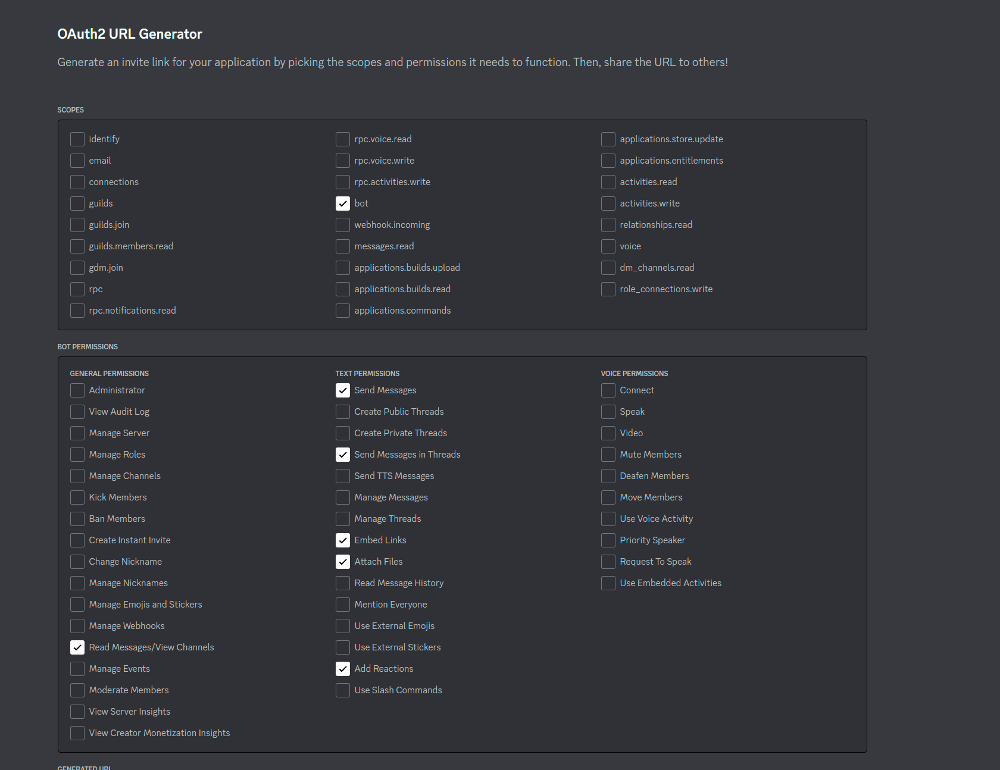

# discord-ao-focus-tracker
Discord bot for tracking guild members focus usage.

1. Create a Discord app here https://discord.com/developers/applications/
   - add a name to the app.
   - next
   - go to "Bot"
   - Add Bot
   - go to "OAuth2"
   - go to "URL Generator"
   - Add the permissions as in the image: 
   - Go to "Bot"
   - Reset Token
   - copy that token and save it as you'll need it later in the code.
2. Create a file called .env that has the contents of .env.example
   - change those values inside the file accordingly.
3. Make sure you have Docker installed on your computer.
4. Run `docker-compose up --build`
   

